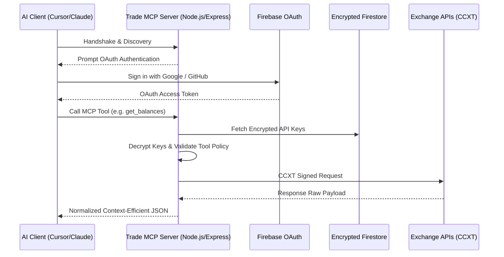

<div align="center">

<p align="center">
  
</p>

<h1 align="center">Trade MCP</h1>

<p align="center">
  <strong>Remote MCP server and dashboard for secure, human-in-the-loop crypto trading workflows.</strong>
</p>

<p align="center">
  
  
  
  
  
  <a href="LICENSE"></a>
</p>

<p align="center">
  
  
  
  
</p>

<p align="center">
  <a href="#-quick-start">Quick start</a> ·
  <a href="#-features">Features</a> ·
  <a href="#-why-remote-mcp">Why Remote MCP?</a> ·
  <a href="#-how-it-works">How it works</a> ·
  <a href="#-configuration">Configuration</a> ·
  <a href="#-quality-checks">Quality checks</a> ·
  <a href="#-support">Support</a> ·
  <a href="SECURITY.md">Security</a> ·
  <a href="CONTRIBUTING.md">Contributing</a> ·
  <a href="CODE_OF_CONDUCT.md">Code of Conduct</a>
</p>

### Secure remote MCP for human-in-the-loop crypto workflows.

</div>

---

## ✨ What Is Trade MCP?

**Trade MCP** transforms AI coding assistants (like Cursor, Claude, and ChatGPT) into secure, production-ready trading agents.

Instead of configuring dozens of local, brittle scripts or exposing raw exchange API keys to LLMs, Trade MCP provides a single, OAuth-secured remote hub. It bridges the gap between powerful language models and secure financial execution by encrypting stored credentials, enforcing granular security profiles, and requiring human-in-the-loop approval for staged trade execution.

---

## 💎 Why It Feels Useful

Setting up algorithmic execution usually requires managing complex local configurations, system services, and raw secrets. Trade MCP changes this:

- **🔐 Secured Credentials:** Exchange connections (Binance, Bybit) and provider API keys are encrypted with AES-256-GCM using the server-side `ENCRYPTION_KEY`. Decryption keys never touch the database.
- **🛡️ Granular Safety Policies:** MCP tools are grouped into profiles (`safe_research`, `trading_review`, `full_access`). Clients cannot run tools above their approved profile.
- **🤝 Human-Approved Execution:** High-risk write actions (submitting orders, moving funds) generate structured proposals that require explicit user confirmation through the dashboard before executing.
- **📊 Unified Multi-Exchange Earn:** Easily search, compare, and track active yield positions across Binance (Flexible/Locked) and Bybit (Flexible/Fixed-term Featured savings).
- **🌐 Remote-First Architecture:** No local dependencies. Works perfectly across cloud servers (like Docker on Contabo), local environments, and SaaS AI platforms.

---

## 🌟 Features

| Group | Key Tools | Description |
|---|---|---|
| **💼 Portfolio & Yield** | `get_balances`, `compare_earn_opportunities`, `get_bybit_earn_position`, `get_binance_earn_positions` | Fetch account balances, track active yield products, and aggregate real-time APRs. |
| **📈 Market & Indicators** | `get_market_price`, `get_crypto_indicators`, `get_taapi_indicators`, `get_news` | Calculate local indicators (EMA, RSI, MACD), query TAAPI.io, and gather CryptoPanic news. |
| **⚡ Execution Control** | `propose_trade`, `review_proposal`, `cancel_proposal` | Generate structured trade proposals that require human-in-the-loop approvals. |
| **🛡️ Access Controls** | OAuth (PKCE), Dashboard API Keys, Policy Profiles | Restrict tool usage by client connection and security scope. |

---

## 🧠 Why Remote MCP?

Local MCP servers are difficult to configure across multiple editors, cannot easily support OAuth, and are highly vulnerable to prompt injection attacks executing destructive actions.

Trade MCP addresses these issues directly:
- **Zero Local Config:** Connect Claude or Cursor to a single HTTPS URL.
- **OAuth-Protected Workspace:** Keep your API keys and portfolio data securely isolated from standard workspace contexts.
- **Blast Radius Mitigation:** Trade proposals are staged as read-only database records. An rogue agent cannot bypass the human approval screen.

---

## 🧭 How It Works



---

## ⚡ Quick Start

### 1. Install Dependencies

Clone the repository and install the production dependencies:

```bash
git clone https://github.com/AmaLS367/TradeMcp.git
cd TradeMcp
npm install
```

### 2. Configure Environment

Create your local `.env` configuration:

```bash
cp .env.example .env
```

Generate a secure 64-character encryption key:

```bash
node -e "console.log(require('crypto').randomBytes(32).toString('hex'))"
```

Configure your `.env` with the generated `ENCRYPTION_KEY` and your Firebase credentials.

### 3. Run the Server

**Development Mode:**
```bash
npm run dev
```

**Production Build:**
```bash
npm run build
npm start
```

**🐳 Docker Deployment:**
```bash
docker compose up -d --build
```

---

## ⚙️ Configuration

Runtime settings are managed securely using `.env` variables:

| Variable | Required | Default | Description |
|---|---|---|---|
| `ENCRYPTION_KEY` | **Yes** | - | 64-char hex key for AES-256-GCM encryption of user API credentials. |
| `FIREBASE_SERVICE_ACCOUNT_KEY` | **Yes** | - | Raw JSON string or path to Firebase Admin SDK service account key. |
| `PORT` | No | `3000` | Port the Express server listens on. |
| `PUBLIC_BASE_URL` | No | `http://localhost:3000` | Public URL of the server (required for production OAuth). |
| `PUBLIC_GITHUB_CLIENT_ID` | No | - | Optional client ID for GitHub OAuth authentication. |
| `PUBLIC_GITHUB_CLIENT_SECRET` | No | - | Optional client secret for GitHub OAuth authentication. |

---

## 🧪 Quality Checks

Keep code clean, typed, and fully tested before every deployment:

```bash
# Type check TypeScript without emitting files
npm run lint

# Run all unit and integration tests using Vitest
npm test
```

---

## 💖 Support

If Trade MCP helps you, you can support development through GitHub Sponsors, referral links, or crypto donations.

| Method | Link |
|---|---|
| GitHub Sponsors | [Sponsor AmaLS367](https://github.com/sponsors/AmaLS367) |
| Bybit referral | [Register with Bybit](https://www.bybit.com/invite?ref=6ANMX04) |
| Binance referral | [Register with Binance](https://www.binance.com/referral/earn-together/refer2earn-usdc/claim?hl=ru&ref=GRO_28502_1KDBV&utm_source=referral_entrance) |

Crypto wallets:

| Network | Address |
|---|---|
| TON | `UQA0r9FHhWDP3HbS5bIN7RPUcF9H8AAzN_P3niATSS5SyALG` |
| MetaMask (BTC) | `bc1q47h0yzwps6hgsmg809q9hy86e3n4jck29sgw6v` |

Referral links may provide a small reward to the maintainer at no extra cost to you.

---

## 📁 Project Structure

```text
TradeMcp/
├── src/
│   ├── server/
│   │   ├── env.ts              # Zod environment schema and validation
│   │   ├── mcpEarn.ts          # Unified Bybit & Binance yield aggregator
│   │   ├── mcpServerFactory.ts # MCP Server creation, tool schemas, and routes
│   │   ├── mcpToolPolicy.ts    # Access profiles and security mapping
│   │   └── logger.ts           # Structured Pino logger
│   └── App.tsx                 # Web dashboard frontend application
├── docs/                       # Comprehensive documentation
│   ├── agent-guide.md          # Multi-tenant agent guides
│   ├── client-setup.md         # ChatGPT, Cursor, and Claude configuration
│   └── architecture.md         # Component mapping and structural flow
├── docker-compose.yml          # Container configuration for VPS deployment
├── package.json                # Project dependencies and workspace scripts
└── tsconfig.json               # TypeScript strict options configuration
```

---

<p align="center">
  Made with 💎 for secure, agentic algorithmic trading.
</p>
